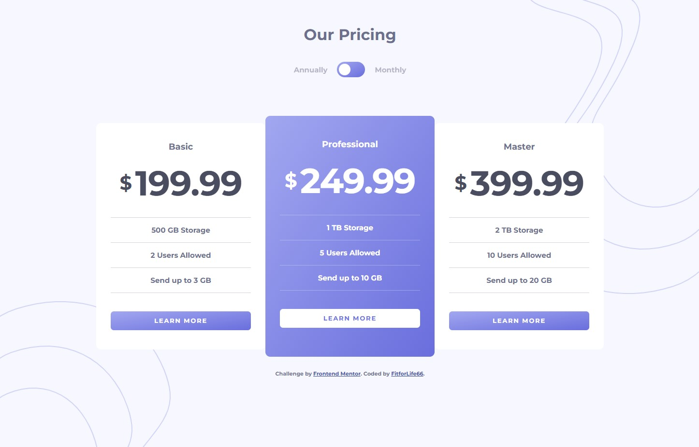

# Frontend Mentor - Pricing component with toggle solution

This is a solution to the [Pricing component with toggle challenge on Frontend Mentor](https://www.frontendmentor.io/challenges/pricing-component-with-toggle-8vPwRMIC). Frontend Mentor challenges help you improve your coding skills by building realistic projects. 

## Table of contents

- [Overview](#overview)
  - [The challenge](#the-challenge)
  - [Screenshot](#screenshot)
  - [Links](#links)
- [My process](#my-process)
  - [Built with](#built-with)
  - [Useful resources](#useful-resources)
- [Author](#author)

## Overview

### The challenge

Users should be able to:

- View the optimal layout for the component depending on their device's screen size
- Control the toggle with both their mouse/trackpad and their keyboard

### Screenshot

### Links

- Solution URL: [GitHub](https://github.com/FitforLife66/pricing_component_with_toggle)
- Live Site URL: [GitHub.io](https://fitforlife66.github.io/pricing_component_with_toggle/)

## My process

### Built with

- Semantic HTML5 markup
- CSS custom properties
- Flexbox
- Mobile-first workflow

### Useful resources

- [Creating a toggle (w3schools)](https://www.w3schools.com/howto/howto_css_switch.asp) - This gave me the bacis idea of how to create a toggle.

## Author

- Website - [FitforLife66](https://github.com/FitforLife66)
- Frontend Mentor - [@FitforLife66](https://www.frontendmentor.io/profile/FitforLife66)

